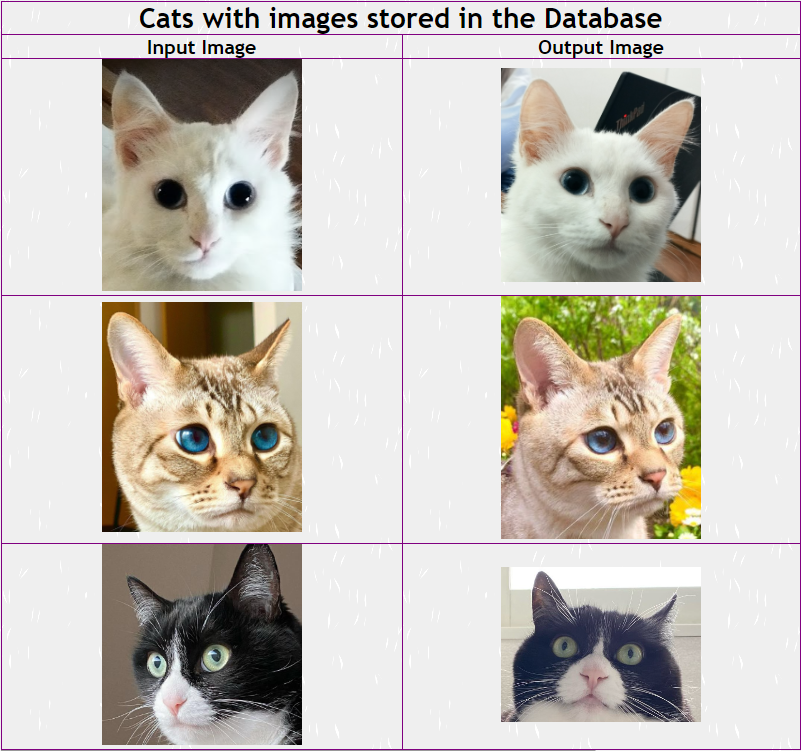
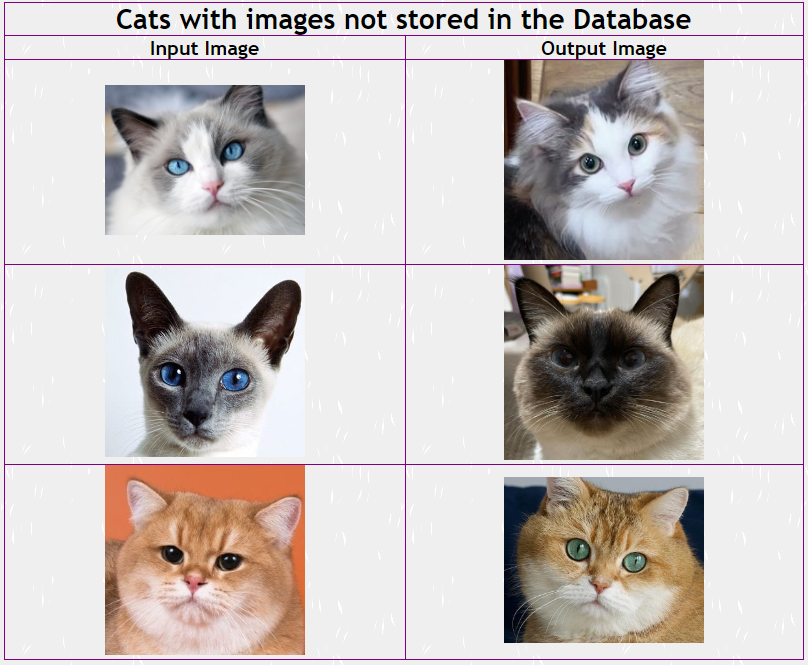
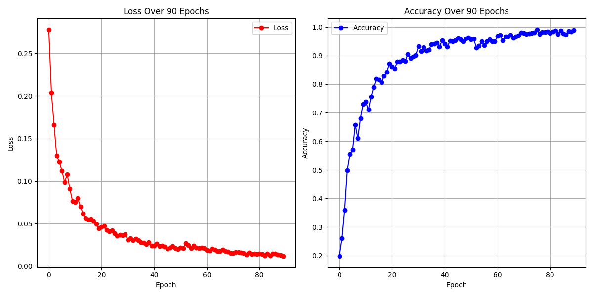

# Cat-Face-Verification
A model using triplet loss to solve the task of cat face verification. Code for this project could be found at <a href='https://github.com/FreyMiggen/Cat-Face-Verification/tree/master'>FreyMiggen-cat-verification</a>.

  
   

## Explain the main idea behind triplet loss
Please read  <a href="https://omoindrot.github.io/triplet-loss">this artice</a> for the main idea behind triplet loss and its usage in Face Verification. 
This is a project that is similar to one the paper of it is published at <a href="http://cs230.stanford.edu/projects_fall_2019/reports/26251543.pdf">Pet Cat Face Verification and Identification</a>.

## Dataset
However, due to the fact that I could not access to the API stipulated in the paper, I have improvised a way to obtain cat images online (tHrough Instagram accounts that post about cat). There are 32 cats in my dataset, each has at least 10 images. The next step is to obtain image of their faces only. I used Yolov5 for this task. By labelling by hand with the help of Label Studio about 100 images of cat face, I created a training dataset big enough for training on Yolov5. The result is quite satisfactory. For more detail, please visit this kaggle notebook <a href="https://www.kaggle.com/code/freymiggen/yolov5">Yolov5 Cat Face detection</a>.

## Model
 The model I use in this project is a Resnet50V2. Initially, I tried to build a model similar to Resnet but shallower from scatch (with about 10 million weights). This simple model acquired the accuracy of around 80% after 100 epochs and the performance did not improve after that. I came to realize that with a small dataset like mine, building a model from scratch is not a clever approach since the model doesnt have enough information to adjust all its weights. Beside, maybe the scale of this simple model is also an issue since it could not embrace enough functions to efficiently encode input images to embedding vectors. The final model I end up using is Resnet50V2 which is pretrained on 'imagenet' 
 I did some small modification to the model so that it suits my purpose better. This model outputs an 32 dimensional embedding feature vector given `224*224*3` image. The last layer of the model is a Lambda one that L2 normalize the embedding vector feature. Only after 60 epochs, the model acquired the accuracy of 99% on the training set and around 97% on the testset, which was a great improvement compared with the former model. 
## Triplet Loss
The approach I use for building loss function is online tripling. This approach is executed spetacularly in <a href="https://omoindrot.github.io/triplet-loss">this artice</a>. The original implementation of online tripling in the aforementioned article does not use regularization. However, in the paper <a href="http://cs230.stanford.edu/projects_fall_2019/reports/26251543.pdf">Pet Cat Face Verification and Identification</a>, a regularization term is introduced, This customized regularization punishes the model when the anchor vector and the negative vector are similar (far from orthogonal). I decided to put this regularization to test and incorporated the it into the loss function.The final loss function used in this model is:
                                       `L = max(d(a, p) - d(a, n) + margin, 0) + alpha*((a^T*n)^2 + max(0,(a^T*n)^2 - (1/d)))` with d set to 32.
The main hyperparameters of the loss function is: 
1. Margin: indicate how far we expect the gap between (anchor_embedding-negative_embedding) and (anchor_embedding-positive_embedding)
2. Alpha: indicate how influential the regularization term is

## Triplet Accuracy metrics
Since the accurary of the model is not obvious from the triplet loss, I have built a function to output the percentage of the triplet that the model succeeds in pushing the gap between dist(anchor,pos) and dist(anchor,neg) larger than margin value. 
## Verification accurary metrics
Although the model performs excellently in the test of triplet accuracy, the real-life application of the model is set differently: Given 2 input images, the model has to decide whether the two images are similar enough to be of the same cat (the distance between their embedding vectors <= lower_threshold - a positive pair) or distinct enough to be of different cats (the distance between their embedding vectors >= upper_threshold - a negative pair). 
To see how the model performs on this task, I have built a function called veri_accuracy. When put on test on the validation set, I obtain some observations:
- The model trained with alpha set to 0.3 acquired the best result in deciding postive pair: with lower_threshold set to 0.6, the model succeeds in 238/262 pairs.
- The model trained with alpha alpha set to 0.5 performs slightly better at telling apart images of negative pairs: with upper_threshold set to 1.2, the model success rate is 4166/4362. But it is the worst at postive pairs.
- The model trained with alpha set to 0.0 acquired the lowest outcome (not by large) in negative pairs. However, it ranks second in postive pairs.
## Training
In order to find out what are the best values for alpha, I have seperately tried using 3 values for alpha : 0 (no regularization); 0.3 ; 0.5. It turned out that for my dataset, the problem pointed out in the paper (that the triplet loss tends to push embeddings quickly collapse to a single vector, setting the loss to be equal to the
margin) is not present since with alpha set to 0; 0.3 or 0.5, the performance of the model does not show a significant improvement or decrease. With all 3 values of alpha, the model obtains the accuracy rate of around 0.95 after 40 epochs and nearly 0.99 after 60 epochs (on the training set). On the validification set, with alpha set to 0.0, 0.3, 0.5, the accuracy rate obtained after 60 epochs is 0.98, 0.99 and 0.96, respectively.

  

## Verification capability
For usage in verification, I have implemented some additional implementation. The goal is to:
- Store 3 best embedding vectors of each cat (function select_anchor_vects).
- When the user inputs an image, it will be passed to the final model and encoded to an 32 dimensional embedding feature vector (input embedding). 
- This vector is than compared to 3 embedding vectors of each cat stored in the database. If there is a cat in the database that the distance between at least 2 out of its  3 best embedding vectors and the input embedding is less or equal to 0.5, than the cat in the input image and the cat with the embedding vectors is decide to be the same one.

# User instruction
Users can use this project for the following tasks:
1. Verification job: to check whether a cat image is already stored in the database. For more detail, run 
`py verify.py -h`
2. Retrain the model. If you have a bigger or a different dataset and want to retrain the model, run `py train.py -h` for more detail
